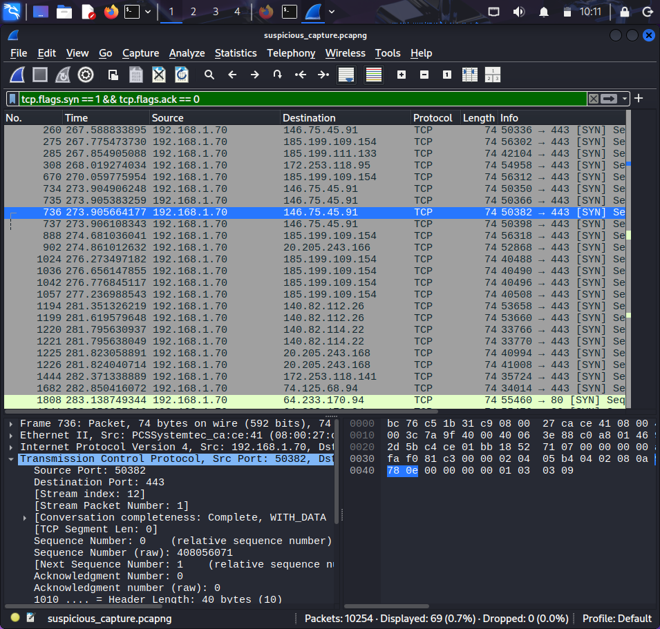
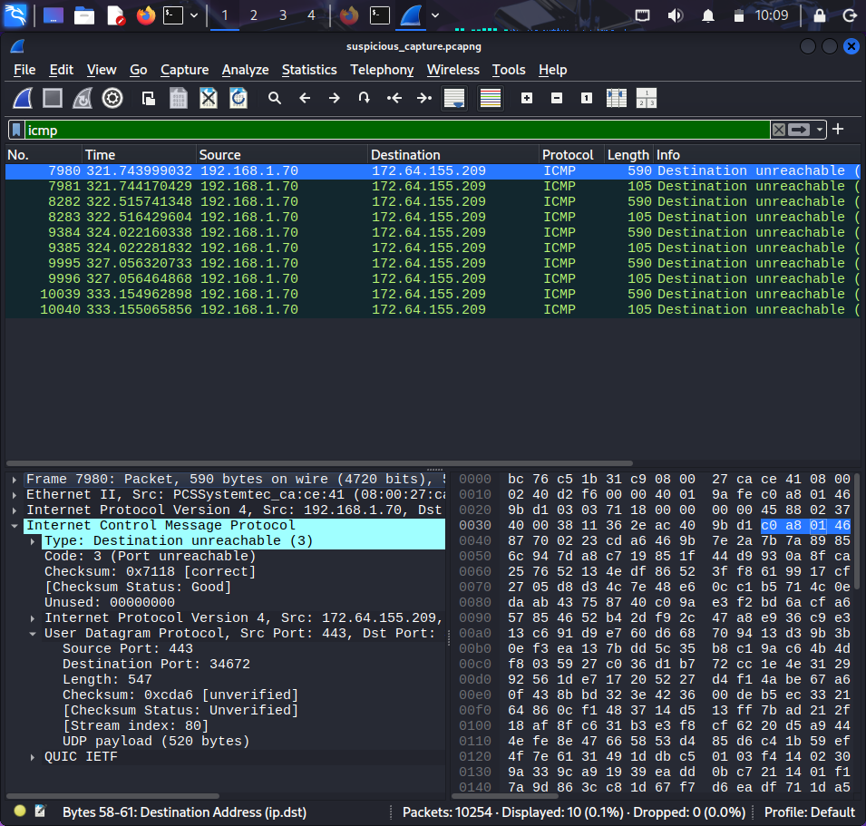
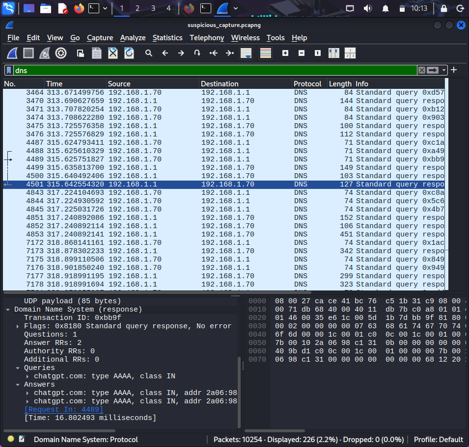
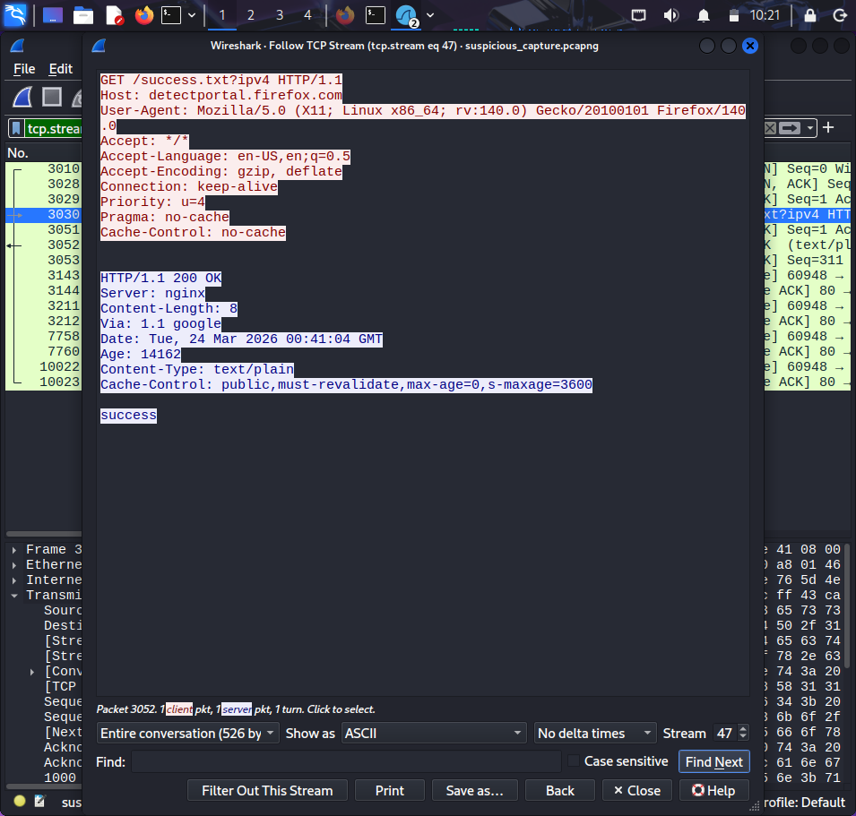
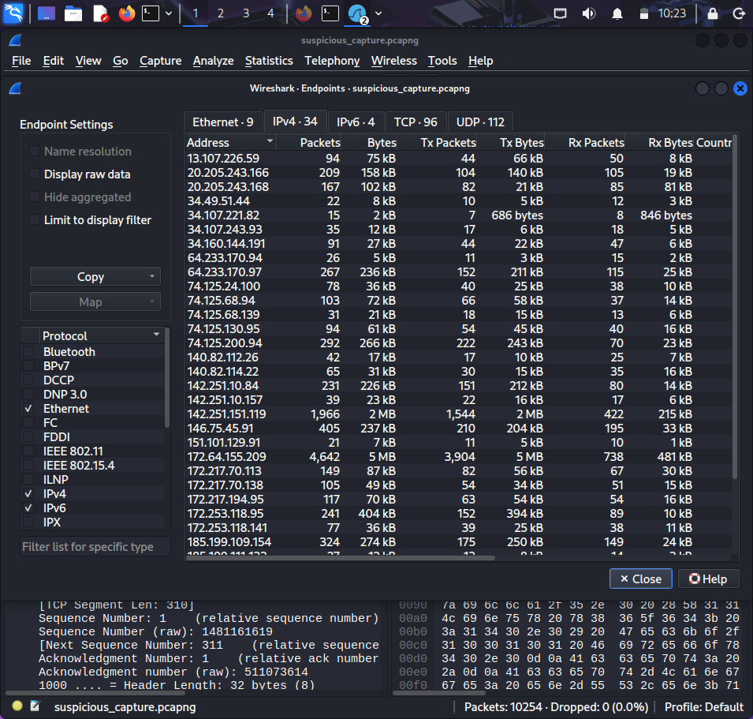

# Suspicious Traffic Analysis using Wireshark

## Objective
Analyze network traffic to detect suspicious activities.

## Tools Used
- Wireshark
- Nmap

## Key Analysis
- Detected SYN packets (possible port scan)
- Observed ICMP flood behavior
- Analyzed DNS queries
- Followed TCP streams
- IP Analysis (Endpoints Statistics)

## Screenshots

### SYN Packets

### ICMP Flood

### DNS Queries

### TCP Stream

### Endpoints Statistics (IP Analysis)

## Conclusion
This project demonstrates the ability to identify abnormal network behavior.
